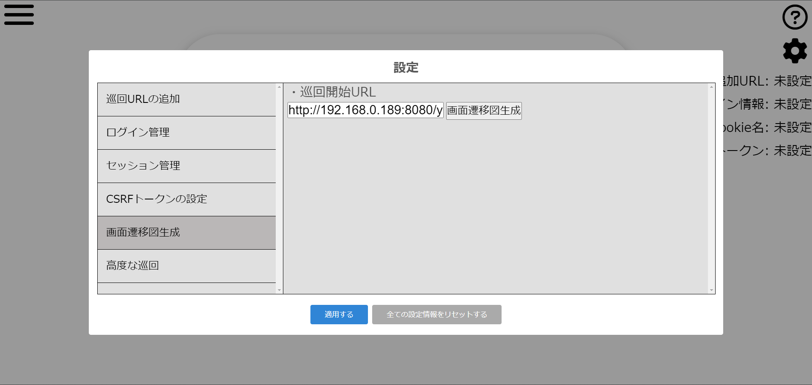
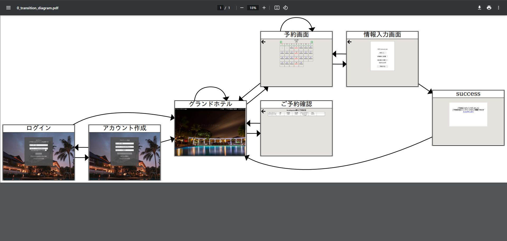

 
# WebScanner
Webサイトの巡回・診断などを自動で行うWebアプリケーションです。
 
# 特徴
 
* ホーム画面から診断対象サイトのURLを入力し、開始ボタンを押すことで自動で\
セキュリティーの診断が行われます。
 
  

* 画面右側の設定メニューでは下記項目を設定できます。
  * URL手動追加
  * ログイン情報の設定
  * セッションIDの設定
  * CSRFトークンの設定
  * 画面遷移図の生成
  * 高度な巡回(プロキシ設定不要)

* 画面遷移図の生成ではWebサイトを巡回し、その結果をPDFファイルとして保存できます。
  
* テスト用サイトから生成した画面遷移図
  

* 高度な巡回機能では実際の操作をもとに巡回していくので、自動巡回では記録が難しいリクエストにも対応できます
  
# インストール

1. このリポジトリをクローンします。
```git
$ git clone https://github.com/furaidopoteto/WebScanner.git
```
2. dockerでコンテナを立ち上げます。
```shell
$ cd WebScanner
$ docker-compose up -d --build
```
3. コンテナが立ち上がったら「[http://127.0.0.1:8080](http://127.0.0.1:8080)」にアクセスすることで使用できます。
 
# 使用ライブラリ
 このプロジェクトでは、下記ライブラリを使用しております。
 - [jQuery](https://jquery.com/) - JavaScriptのライブラリ (MIT License)
 - [Font Awesome](https://fontawesome.com/) - アイコン等 (MIT License)
 - [Icons8](https://icons8.jp/) - アイコン等 (CC BY-ND 3.0)
 - [echarts](https://echarts.apache.org/en/index.html) - グラフ描画 (Apache License 2.0)
 - [Prism.js](https://prismjs.com/) - シンタックスハイライト(MIT License)
 - [SweetAlert2](https://sweetalert2.github.io/) - ポップアップの表示(MIT License)

# 使用ブラウザ
* Chrome([ChromeDriver](https://github.com/geonetwork/chromedriver)) - (BSD 3-Clause "New" or "Revised" License)

# ※注意事項

* 本アプリケーションはローカル環境に対して使用することを推奨しております。

* 本アプリケーションを使用したトラブルについては一切の責任を負いませんので、その旨をご理解の上ご利用ください。

* 診断スピードは実行端末のCPUに依存します。診断時間を短縮したい場合はなるべく高性能なCPUを搭載した機器で実行することをお勧めいたします。

* vmmem WSLというプロセスがメモリを大幅に確保してしまうバグが発生する場合がございます。万が一そのバグが発生した場合は.wslconfigファイルで確保メモリの制限やswapを設定してください。